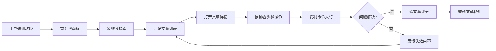
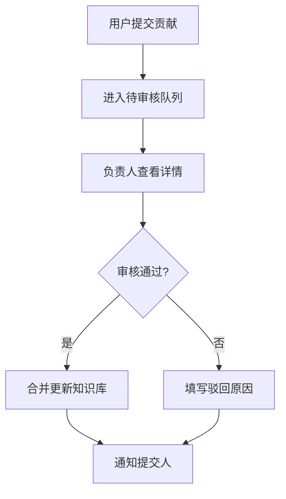

## 1. 产品概述

故障知识库Web应用，面向一线值班人员、客服技术支持和新入职研发，提供快速查找故障处理办法的一站式平台。通过结构化的知识文章、智能检索和故障诊断工具，缩短平均故障解决时间（MTTR），提升团队协作效率。

- 核心价值：将分散的故障处理经验沉淀为可复用的知识资产，降低新人上手门槛
- 目标用户：一线运维值班、技术支持客服、新入职研发工程师、知识管理员

## 2. 核心功能

### 2.1 用户角色

| 角色 | 说明 | 核心权限 |
|------|------|----------|
| 普通用户 | 值班/客服/研发 | 检索知识、查看详情、收藏文章、评分、反馈、提交补充案例 |
| 内容贡献者 | 资深研发/运维 | 普通用户权限 + 提交新文章、申请更新 |
| 审核负责人 | 领域专家/技术Leader | 全部权限 + 审核贡献内容、更新文章、管理分类 |

### 2.2 功能模块

1. **知识首页**：搜索入口、热门问题、分类导航、最新更新、值班手册快捷入口
2. **文章详情页**：排查步骤、常用命令（可复制）、注意事项、适用版本、补充案例、关联事故、评分评分、反馈失效
3. **故障诊断页**：按现象/服务/错误码多维度检索，智能筛选，诊断流程引导
4. **收藏夹页**：收藏的高频文章列表，分类整理，快速访问
5. **贡献审核页**：待审核贡献列表，审核操作（通过/驳回），历史审核记录

### 2.3 页面详情

| 页面名称 | 模块名称 | 功能描述 |
|---------|----------|----------|
| 知识首页 | 搜索区 | 支持按关键词、现象、服务、错误码联合搜索，带搜索建议下拉 |
| 知识首页 | 热门问题TOP10 | 按访问量/评分排序展示热门故障文章，带趋势标识 |
| 知识首页 | 服务分类导航 | 按业务服务维度分类（订单/支付/用户/消息等），点击可筛选 |
| 知识首页 | 最新更新 | 展示最近新增/更新的文章列表，带版本标记 |
| 知识首页 | 统计面板 | 知识总量、本月新增、平均解决时长、热门服务分布 |
| 文章详情页 | 文章头部 | 标题、服务标签、错误码、适用版本、评分、收藏按钮 |
| 文章详情页 | 故障现象 | 详细描述故障表现、触发条件、影响范围 |
| 文章详情页 | 排查步骤 | 编号步骤列表，含检查命令、预期结果、异常处理分支 |
| 文章详情页 | 常用命令 | 代码块展示，一键复制按钮，含命令说明和风险提示 |
| 文章详情页 | 注意事项 | 警示样式展示操作禁忌、回滚方案、业务影响说明 |
| 文章详情页 | 关联历史事故 | 事故编号、时间、影响范围、处理总结链接 |
| 文章详情页 | 补充案例 | 用户提交的实际场景案例，含时间线和处理心得 |
| 文章详情页 | 提交补充 | 表单提交案例：场景描述、处理过程、截图、适用版本 |
| 文章详情页 | 反馈与评分 | 5星评分、是否解决问题、失效反馈（原因选择+描述） |
| 故障诊断页 | 多维度筛选 | 现象标签、服务选择、错误码输入、版本范围、时间范围 |
| 故障诊断页 | 诊断结果列表 | 匹配度排序，展示匹配字段高亮，快速预览核心步骤 |
| 故障诊断页 | 诊断引导流程 | 交互式问答式诊断，根据选择逐步缩小范围 |
| 收藏夹页 | 收藏列表 | 卡片式展示，支持按服务/时间排序，快速取消收藏 |
| 收藏夹页 | 生成值班手册 | 勾选收藏文章，一键导出Markdown格式值班手册 |
| 贡献审核页 | 待审核列表 | 卡片展示：贡献类型、提交人、时间、内容摘要 |
| 贡献审核页 | 审核详情面板 | 左右对比（原文 vs 提议），通过/驳回按钮，审核备注 |
| 贡献审核页 | 审核记录 | 历史审核流水，筛选条件，导出审核报表 |

## 3. 核心流程

### 3.1 故障排查主流程

用户遇到故障 → 进入首页搜索 → 输入关键词/选择现象/服务/错误码 → 查看匹配文章列表 → 打开文章详情 → 按排查步骤操作 → 复制常用命令执行 → 解决后评分/未解决反馈 → 收藏备用

### 3.2 知识贡献审核流程

用户发现新案例/文章错误 → 提交补充/修正 → 进入审核队列 → 负责人审核 → 通过则合并更新 / 驳回则注明原因 → 通知提交人

## 4. 用户界面设计

### 4.1 设计风格

**整体风格：专业、高效、可信的企业级技术工具风格**

- **主色调**：深海蓝 `#0F172A` → 科技感与稳重感，搭配亮青 `#06B6D4` 作为强调色（状态提示、链接、按钮）
- **辅助色**：警示橙 `#F59E0B`（注意事项）、危险红 `#EF4444`（严重故障、删除）、成功绿 `#10B981`（已解决）
- **中性色**：Slate系列（`#F8FAFC` `#F1F5F9` `#E2E8F0` `#CBD5E1` `#94A3B8` `#64748B` `#475569` `#334155`）
- **字体**：主字体使用 `Inter` 搭配中文 `PingFang SC / Microsoft YaHei`，代码块使用 `JetBrains Mono`
- **按钮样式**：圆角中等（`rounded-lg`），主按钮使用渐变背景 + 微阴影，悬停状态有轻微上浮效果
- **布局风格**：顶部固定导航 + 左侧可折叠分类边栏 + 主内容区，卡片式内容容器，大量留白
- **图标**：Lucide React 图标库，统一线性风格，尺寸16px/20px/24px三档
- **质感**：细微的磨砂玻璃效果（`backdrop-blur-sm`）用于悬浮面板，柔和投影（`shadow-sm`）区分层级

### 4.2 页面设计概览

| 页面名称 | 模块名称 | UI设计要点 |
|---------|----------|-----------|
| 知识首页 | 搜索区 | 大尺寸搜索框居中，背景为深蓝渐变+网格纹理，输入时有焦光环效果，搜索建议下拉卡片 |
| 知识首页 | 热门问题 | 排名序号用渐变圆形徽章，趋势指标用↑↓箭头+颜色，悬停卡片微微上浮 |
| 知识首页 | 服务分类 | 可滚动的图标卡片网格，每个服务有独特图标+背景色，点击有选中高亮 |
| 知识首页 | 统计面板 | 4个数据卡片横向排列，数字用大号字体+亮青色，配小型趋势迷你图 |
| 文章详情页 | 目录锚点 | 右侧悬浮TOC导航，滚动时自动高亮当前章节，平滑滚动过渡 |
| 文章详情页 | 步骤列表 | 带连接线的时间线样式，当前步骤高亮，完成步骤打勾 |
| 文章详情页 | 命令代码块 | 深色主题代码框，右上角复制按钮，悬停显示复制提示 |
| 文章详情页 | 注意事项 | 左侧橙色竖条+三角形警示图标，背景浅橙色，重要文字加粗 |
| 故障诊断页 | 筛选区 | 粘性顶部筛选栏，标签多选、服务下拉、错误码输入、版本滑块 |
| 故障诊断页 | 结果卡片 | 匹配度百分比进度条，匹配字段高亮标记（<mark>样式） |
| 收藏夹页 | 手册生成 | 模态框勾选列表，生成进度条动画，下载按钮脉冲效果 |
| 贡献审核页 | 对比视图 | 左右分栏对比，差异文字高亮（新增绿色下划线/删除红色删除线） |

### 4.3 响应式设计

- **桌面端（≥1280px）**：三栏布局，左侧分类+主内容+右侧详情/TOC
- **平板端（768-1279px）**：两栏布局，左侧分类可折叠为图标栏
- **移动端（<768px）**：单栏布局，顶部汉堡菜单展开分类，底部Tab导航切换主功能

### 4.4 交互动效

- 页面加载：内容渐入 + 卡片依次错开淡入（stagger 50ms）
- 悬停：卡片 `translateY(-2px)` + `shadow-md`，过渡150ms ease
- 按钮：点击 `scale(0.97)` 回弹效果
- 搜索：输入时实时过滤结果，带加载旋转指示器
- 复制命令：点击后按钮变对勾 + "已复制"提示2秒
- 评分星星：悬停预览，点击填充动画
