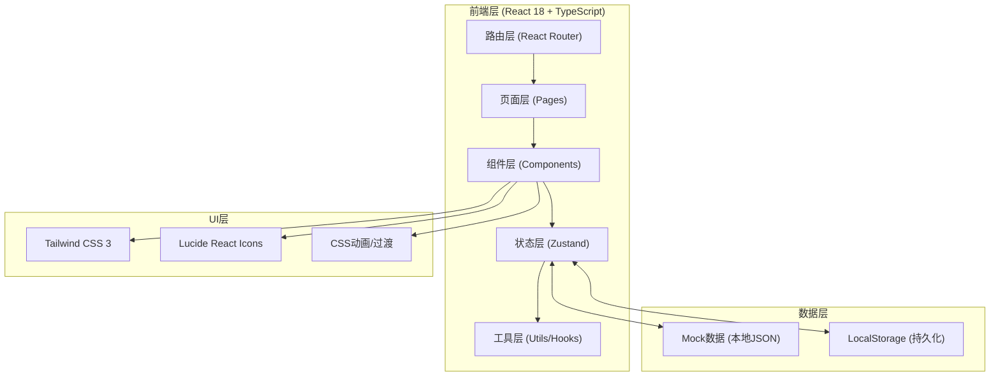
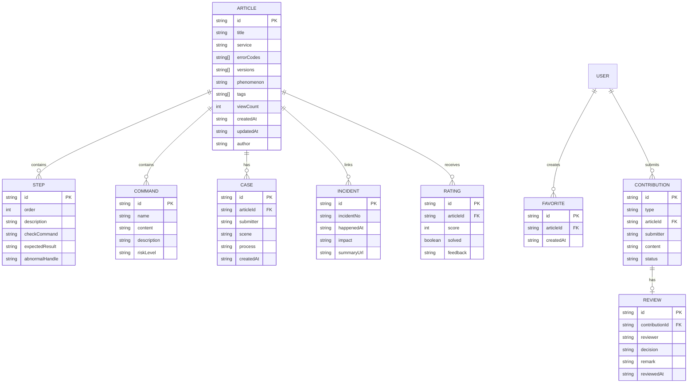

## 1. 架构设计



## 2. 技术描述

- **前端框架**：React 18 + TypeScript
- **构建工具**：Vite 5 (vite-init)
- **样式方案**：Tailwind CSS 3.4
- **路由管理**：react-router-dom 6
- **状态管理**：zustand 4
- **图标库**：lucide-react
- **后端服务**：无（纯前端，使用Mock数据 + LocalStorage模拟持久化）
- **数据存储**：浏览器 LocalStorage
- **初始化模板**：react-ts（纯前端项目，含react-router-dom、tailwind、zustand）

## 3. 路由定义

| 路由路径 | 页面组件 | 功能说明 |
|---------|----------|----------|
| `/` | HomePage | 知识首页（搜索、热门、分类、统计） |
| `/article/:id` | ArticleDetailPage | 文章详情页（排查步骤、命令、评分等） |
| `/diagnosis` | DiagnosisPage | 故障诊断页（多维度检索、引导流程） |
| `/favorites` | FavoritesPage | 收藏夹页（收藏列表、生成值班手册） |
| `/review` | ReviewPage | 贡献审核页（待审核列表、审核操作、记录） |

## 4. 数据模型

### 4.1 实体关系图



### 4.2 TypeScript 类型定义

```typescript
// 文章
export interface Article {
  id: string;
  title: string;
  service: ServiceType;
  errorCodes: string[];
  versions: string[];
  phenomenon: string;
  attention: string[];
  tags: string[];
  viewCount: number;
  ratingAvg: number;
  ratingCount: number;
  createdAt: string;
  updatedAt: string;
  author: string;
  steps: Step[];
  commands: Command[];
  incidents: Incident[];
  cases: CaseItem[];
}

export type ServiceType = 
  | 'order' | 'payment' | 'user' | 'message' 
  | 'search' | 'gateway' | 'database' | 'cache';

export interface Step {
  id: string;
  order: number;
  description: string;
  checkCommand?: string;
  expectedResult?: string;
  abnormalHandle?: string;
}

export interface Command {
  id: string;
  name: string;
  content: string;
  description: string;
  riskLevel: 'low' | 'medium' | 'high';
}

export interface Incident {
  id: string;
  incidentNo: string;
  happenedAt: string;
  impact: string;
  summaryUrl: string;
}

export interface CaseItem {
  id: string;
  submitter: string;
  scene: string;
  process: string;
  createdAt: string;
}

export interface Rating {
  id: string;
  articleId: string;
  score: 1 | 2 | 3 | 4 | 5;
  solved: boolean;
  feedback?: string;
  createdAt: string;
}

export interface Favorite {
  id: string;
  articleId: string;
  createdAt: string;
}

export type ContributionType = 'new_article' | 'update_article' | 'new_case';
export type ContributionStatus = 'pending' | 'approved' | 'rejected';

export interface Contribution {
  id: string;
  type: ContributionType;
  articleId?: string;
  submitter: string;
  title: string;
  summary: string;
  diffContent?: string;
  status: ContributionStatus;
  createdAt: string;
}

export interface ReviewRecord {
  id: string;
  contributionId: string;
  reviewer: string;
  decision: 'approved' | 'rejected';
  remark: string;
  reviewedAt: string;
}

export interface SearchFilter {
  keyword?: string;
  service?: ServiceType | 'all';
  errorCode?: string;
  version?: string;
  tags?: string[];
}
```

## 5. 目录结构

```
src/
├── components/           # 公共组件
│   ├── Layout/          # 布局组件（Header、Sidebar、Footer）
│   ├── Search/          # 搜索相关组件
│   ├── Article/         # 文章相关组件（Card、StepList、CommandBlock）
│   ├── UI/              # 通用UI组件（Button、Tag、Modal、Badge）
│   └── Rating/          # 评分、反馈组件
├── pages/               # 页面组件
│   ├── HomePage.tsx
│   ├── ArticleDetailPage.tsx
│   ├── DiagnosisPage.tsx
│   ├── FavoritesPage.tsx
│   └── ReviewPage.tsx
├── store/               # Zustand状态管理
│   ├── articleStore.ts
│   ├── favoriteStore.ts
│   └── reviewStore.ts
├── data/                # Mock数据
│   └── mockArticles.ts
├── utils/               # 工具函数
│   ├── search.ts        # 搜索匹配算法
│   ├── export.ts        # 导出值班手册
│   └── storage.ts       # LocalStorage封装
├── hooks/               # 自定义Hooks
│   ├── useCopy.ts       # 复制到剪贴板
│   └── useDebounce.ts   # 防抖搜索
├── types/               # 类型定义
│   └── index.ts
├── App.tsx
├── main.tsx
└── index.css
```
